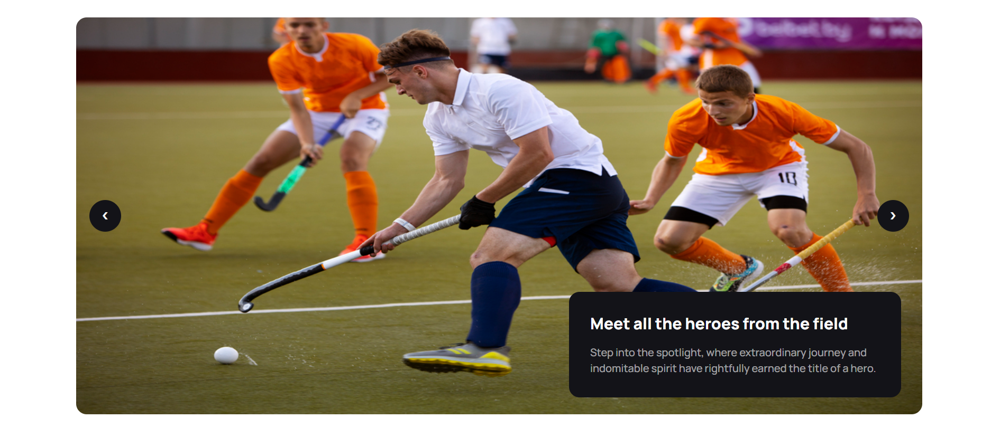

# 🏒 Hockey's – Club Landing Page

**Hockey's** is a responsive hockey club landing page built with **HTML**, **Tailwind CSS**, and **DaisyUI**. It highlights the club’s offerings, programs, merchandise, and essential contact info in a clean and modern layout. Fully optimized for all devices.

[🔗 Live Demo](https://devo-ab.github.io/hockeys)

---

---

## 🛠️ Tech Stack

- **HTML5**
- **Tailwind CSS**
- **DaisyUI**

---

## 🌟 Features

- ✅ Responsive Navbar
- ✅ Hero Section with Slider
- ✅ Club Details & Mission
- ✅ Training Programs Overview
- ✅ Product Showcase Section
- ✅ FAQ Section
- ✅ Contact Form
- ✅ Social Links
- ✅ Footer with essential links


## 📁 Folder Structure

```
hockeys
├── assets
│   ├── banner
│   │   ├── banner1.png
│   │   ├── banner2.jpg
│   │   └── banner3.jpg
│   ├── images
│   │   ├── 10.png
│   │   ├── 11.png
│   │   ├── 2.png
│   │   ├── 3.png
│   │   ├── 4.png
│   │   ├── 5.png
│   │   ├── 6.png
│   │   ├── 7.png
│   │   ├── 8.png
│   │   └── 9.png
│   └── logo
│       ├── Group 1171275317.png
│       ├── Group 1171275318.png
│       ├── Group 1171275321.png
│       └── hockeylogo.png
├── preview
│   ├── club details.png
│   ├── hero.png
│   └── preview.png
├── index.html
├── readme.md
└── tailwind.config.js
```

---

## 🖼️ Screenshots

### 🧭 Hero Banner & Navbar



### 🚲 Club Details


### 👣 Full page preview


---

## 📲 How to Use Locally

1. **Clone the repo**
   ```bash
   git clone https://github.com/devo-ab/hockeys.git
   cd hockeys
   ```

# 👤 Author

# Avi Jit

## :mailbox: Reach me out

<p align="left">
<a href="https://linkedin.com/in/itsavijitb" target="blank"></a>
<a href="https://twitter.com/itsavijitb" target="blank"></a>
<a href="https://facebook.com/itsavijitb" target="blank"></a>
<a href="https://instagram.com/itsavijitb" target="blank"></a>
</p>
